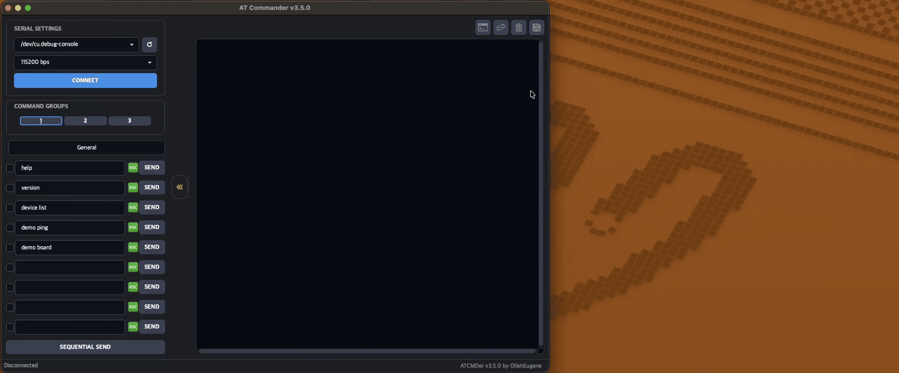

# ATCMDer

This program is designed to make it easier to control devices via serial communication by allowing users to send predefined commands with a single click. While it also supports the traditional method of entering commands manually through a terminal window, it provides additional functionality such as sending individual preset commands using dedicated send buttons, or executing multiple commands at once based on a scheduled time.

For more detailed information about the supported features, please refer to the description below.

**Support Features**

- 🚀 Powerful Features for a Seamless Serial Communication Experience
- 🌈 Rich ANSI Color Support – Clear, vivid terminal output
- 🕘 Command History – Easily reuse previously entered commands. It can be used next time execution as well
- 📋 Predefined Command Lists – Load and manage custom command sets with ease
- 🔌 Auto Reconnect – Instantly reconnects to your last-used serial port
- 📄 Sequential Command Execution – Automate multi-step test
- 🪟 Expandable Output Window – Clean and flexible UI layout
- ⌨️ Keyboard Shortcuts – Speed up your workflow
- 🖥️ Cross-Platform – Compatible with macOS, Windows, and Linux
- 🎨 Customizable Themes – Style your interface with CSS-based theming
- 🧾 Line Numbers & Timestamps – Better tracking and debugging in the terminal

 
> Note: When using it on macOS, you need to allow it in the Security & Privacy settings in order to use it

